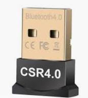
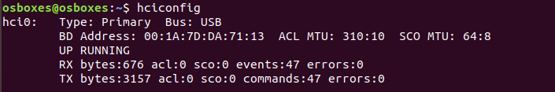
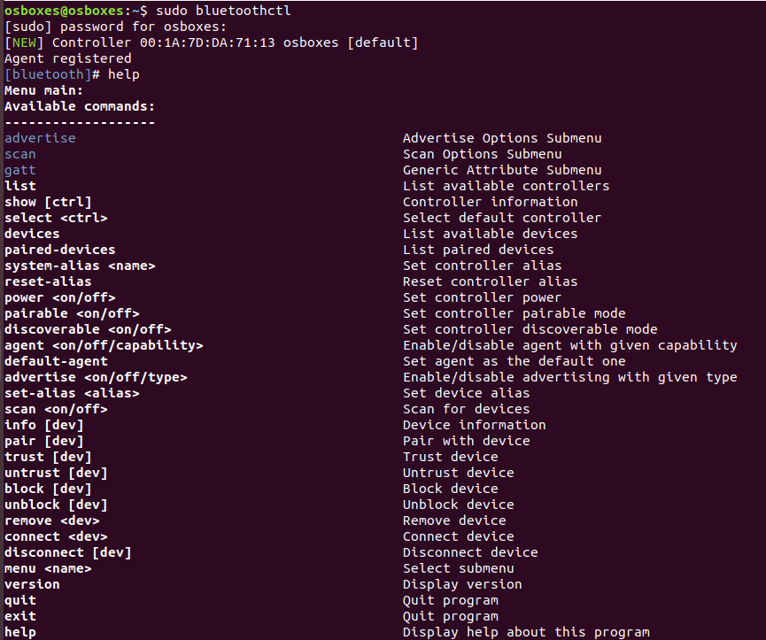
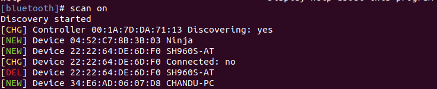
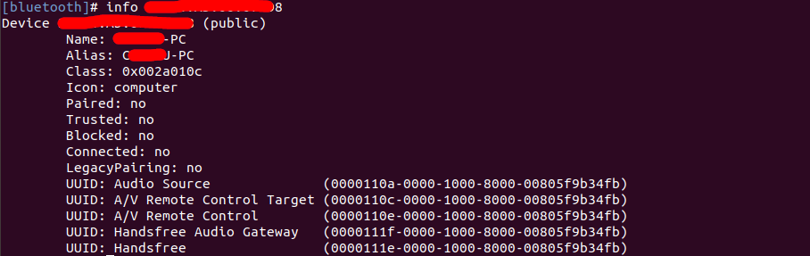

### Discovering bluetooth and bluetooth low energy devices

Connect a external adapter CSR4.0 Dongle if you are using virtualbox or Host Machine internal bluetooth works but if you have adapter more better
   
   
   
   

check with whether blueotooth adapter is working 

"#hciconfig" - to check adapter it is connected and running or not 
   
   

if the adapter is not up run the command " #hciconfig hcix up"

***********************************************************************************************************************

### 1. find with "bluetoothctl"

it is preinstalled in linux machines or you can install with [sudo apt-get install bluez]

   bluetoothctl
    
   #bluetoothctl 
   [bluetooth]#help
   
   
            
   [bluetooth]#scan on 
   or 
   [bluetooth]#bluetoothctl discoverable on
   - to scan surrounded devices classic and bluetooth low energy devices can be found by this tool 
   
   
            
   [bluetooth]#scan off
   - to stop the scanner
   
   
      
   [bluetooth]#info <Target MAC ID>
   - get the device info 
   
   
   
   [bluetooth]# connect 00:12:34:56:78:90
   - to pair with device
   
   
   
********************************************************************************************************************************

### 2. ScanNRecon with "hcitool"

   - hcitool (hci-host controller interface) is one of the bluetooth configure tools to send the commands to bluetooth devices to discover and communcate
   
   #sudo hcitool -h 
   - help command
   
   
   #sudo hcitool scan
   - scan for the non LE (Low - Energy) Devices
   
   
   #sudo hcitool info <b addr>
   - to get the details of the remote devices
   
   
   #sudo hcitool cc 
   - to get connect with devices 
      
   #sudo hcitool lescan
   - scan for the LE Devices
   
   #sudo hcitool leinfo <baddr>
   - to find the device information about the LE device
   
   #sudo hcitool lecc  <baddr>
   - to get connect with LE devices
   
   #sudo hcitool 

******************************************************************************************************************************

