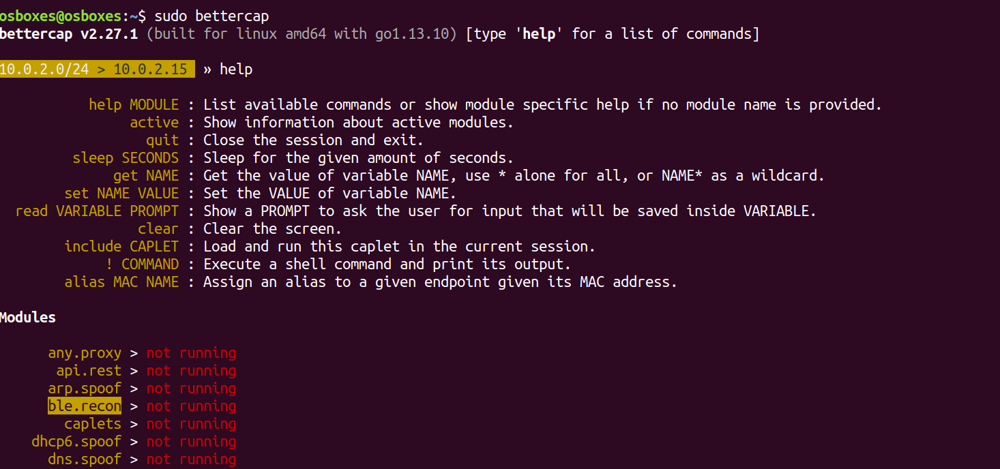
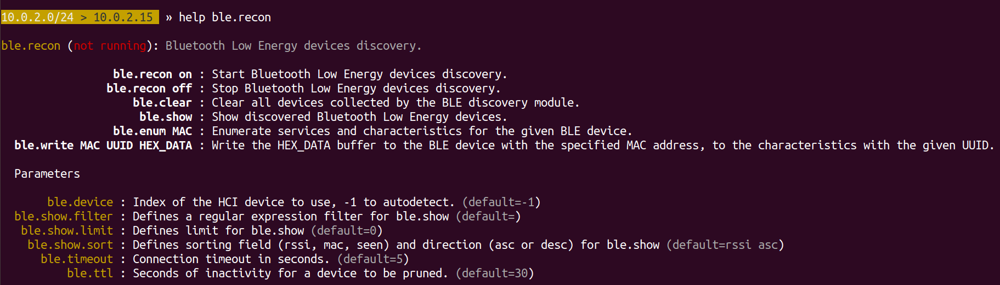
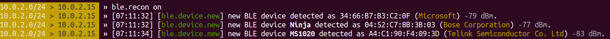
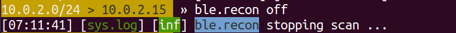
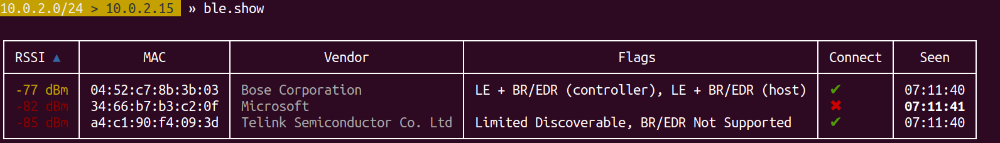

### Discovering bluetooth and bluetooth low energy devices

Connect a external adapter CSR4.0 Dongle if you are using virtualbox or Host Machine internal bluetooth works but if you have adapter more better
   
   
   
   

check with whether blueotooth adapter is working 

"#hciconfig" - to check adapter it is connected and running or not 
   
   

if the adapter is not up run the command " #hciconfig hcix up"

#### 1. find with "bluetoothctl"

it is preinstalled in linux machines or you can install with [sudo apt-get install bluez]

   bluetoothctl
    
   #bluetoothctl 
   [bluetooth]#help
   
   
            
   [bluetooth]#scan on 
   or 
   [bluetooth]#bluetoothctl discoverable on
   - to scan surrounded devices classic and bluetooth low energy devices can be found by this tool 
   
   
            
   [bluetooth]#scan off
   - to stop the scanner
   
   
      
   [bluetooth]#info <Target MAC ID>
   - get the device info 
   
   
   
   [bluetooth]# connect 00:12:34:56:78:90
   - to pair with device
   
   
   

   
   [ScanNRecon with "hcitool"](https://github.com/V33RU/BLE-UAE/blob/master/scanNrecon/hcitool.md)
   
   
#### 3. find with "bettercap"
      
   - betterCAP is one of the best tool developed in golang and works simply awesome. while you running the installation script it is automatically downloads the precompiled binaries 
   - step 1: unzip the bettercap folder
   - step 2: move the bettercap binary file to /usr/bin location -- sudo mv bettercap /usr/bin
   - step 3: install dependencies "*sudo apt-get install libnetfilter-queue-dev*" and type bettercap in terminal 
   
   #sudo bettercap 
   
   #help
   
   - checking tool options and usage guide
   
   
   
   #help ble.recon
   
   - module way checking for help
   
   
   
   #ble.recon on
   
   - scanning for bluetooth devices
   
   
   
   #ble.recon off
   
   - for stopping the scan 
   
   
   
   #ble.show
   
   - to show discovered devices
   
   
   
   #ble.enum <B Addr>
   
   - enumeratins services and characteristics of devices
   
   
   
   
#### 4. Find with "NRF Connect APP - Android and Desktop"
#### 5. Find with "Custom Scanners"

