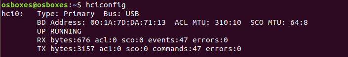

### Reconnaiance on bluetooth and bluetooth low energy devices

Connect a external adapter CSR4.0 Dongle if you are using virtualbox or Host Machine internal bluetooth works but if you have adapter more better
   
   
   
   

check with whether blueotooth adapter is working 

"#hciconfig" - to check adapter it is connected and running or not 
   
   

if the adapter is not up run the command " #hciconfig hcix up"

#### 1. Recon with "bluetoothctl"

it is preinstalled in linux machines or you can install with [sudo apt-get install bluez]

   bluetoothctl
    
   #bluetoothctl 
   [bluetooth]#help
   
   
            
   [bluetooth]#scan on 
   or 
   [bluetooth]#bluetoothctl discoverable on
   - to scan surrounded devices classic and bluetooth low energy devices can be found by this tool 
   
   
            
   [bluetooth]#scan off
   - to stop the scanner
   
   
      
   [bluetooth]#info <Target MAC ID>
   - get the device info 
   
   
   
   [bluetooth]# connect 00:12:34:56:78:90
   - to pair with device
   
   
   
#### 2. Recon with "hcitool"
#### 3. Recon with "bettercap"
#### 4. Recon with "NRF Connect APP - Android and Desktop"
#### 5. Recon with "Custom Scanners"

