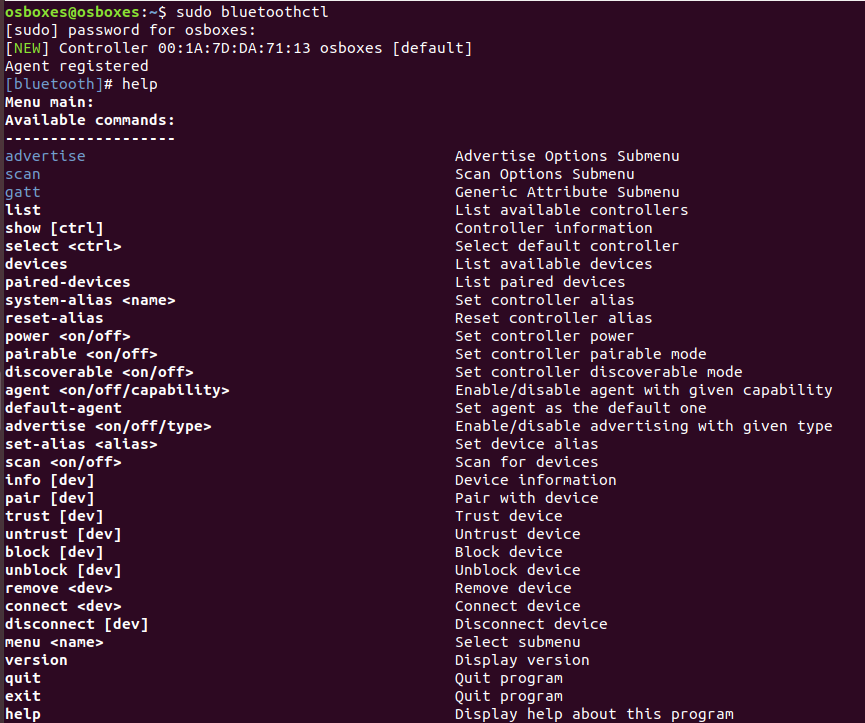

### Reconnaiance on bluetooth and bluetooth low energy devices

Connect a external adapter CSR4.0 Dongle if you are using virtualbox or Host Machine internal bluetooth works but if you have adapter more better
   
   
   
   

check with whether blueotooth adapter is working 

"#hciconfig" - to check adapter it is connected and running or not 
   
   

if the adapter is not up run the command " #hciconfig hcix up"

#### Recon with "bluetoothctl"

it is preinstalled in linux machines or you can install with [sudo apt-get install bluez]

1. bluetoothctl
    
     #bluetoothctl 
     
      > help
      
            
     >scan on 
            
     
            
      >scan off
     
            
3. 
