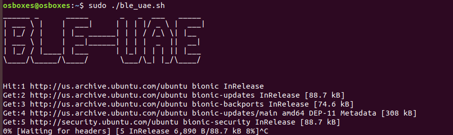
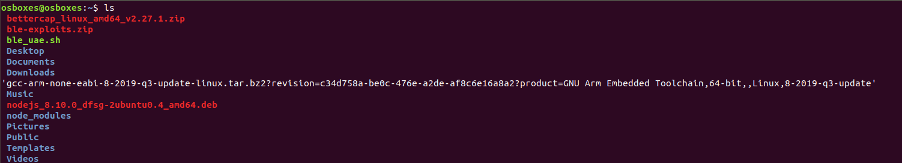

#### Installation Procedure

+  ***Download and install plain OS of Ubuntu 16.04 as host or install in virtualbox 6 

+  ***Once install download the script give the permission "chmod 775 ble_uae.sh" and run in linux machine 
(ble_uae.sh)

+ ***once you ran the script it will install and download the requirement tools of hacking the bluetooth communication 

+ ***i made folder creation as a comment in script while you running give your own name and remove the comment and run the script all tools will be installed in partcular folder
        `#mkdir session-owasp`
         `#cd session-owasp`
